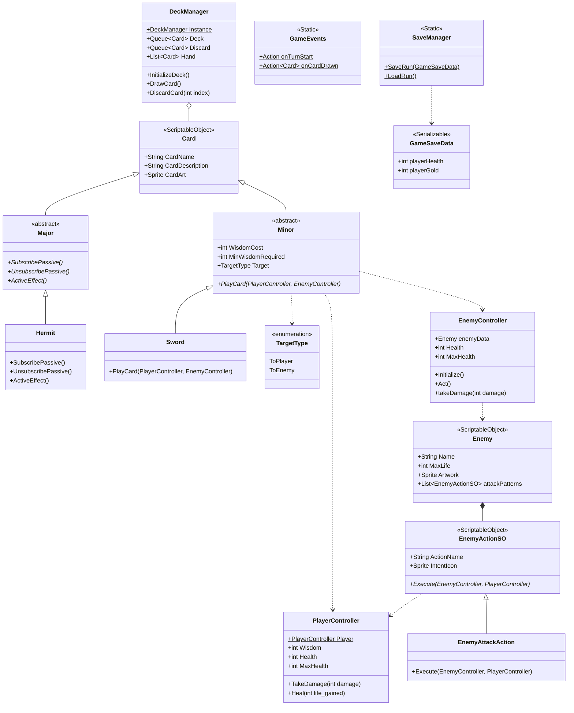

```mermaid
classDiagram
    %% Game Data
    class Card {
        <<ScriptableObject>>
        +String CardName
        +String CardDescription
        +Sprite CardArt
    }
    class Major {
        <<abstract>>
        +SubscribePassive()*
        +UnsubscribePassive()*
        +ActiveEffect()*
    }
    class Hermit {
        +SubscribePassive()
        +UnsubscribePassive()
        +ActiveEffect()
    }
    class Minor {
        <<abstract>>
        +int WisdomCost
        +int MinWisdomRequired
        +TargetType Target
        +PlayCard(PlayerController, EnemyController)*
    }
    class Sword {
        +PlayCard(PlayerController, EnemyController)
    }
    class TargetType {
        <<enumeration>>
        ToPlayer
        ToEnemy
    }
    Card <|-- Major
    Card <|-- Minor
    Major <|-- Hermit
    Minor <|-- Sword
    Minor ..> TargetType

    %% Enemy Data
    class Enemy {
        <<ScriptableObject>>
        +String Name
        +int MaxLife
        +Sprite Artwork
        +List~EnemyActionSO~ attackPatterns
    }
    class EnemyActionSO {
        <<ScriptableObject>>
        +String ActionName
        +Sprite IntentIcon
        +Execute(EnemyController, PlayerController)*
    }
    class EnemyAttackAction {
        +Execute(EnemyController, PlayerController)
    }
    EnemyActionSO <|-- EnemyAttackAction
    Enemy *-- EnemyActionSO

    %% Entities
    class PlayerController {
        +PlayerController Player$
        +int Wisdom
        +int Health
        +int MaxHealth
        +TakeDamage(int damage)
        +Heal(int life_gained)
    }
    class EnemyController {
        +Enemy enemyData
        +int Health
        +int MaxHealth
        +Initialize()
        +Act()
        +takeDamage(int damage)
    }
    EnemyController ..> Enemy

    %% Core Systems
    class DeckManager {
        +DeckManager Instance$
        +Queue~Card~ Deck
        +Queue~Card~ Discard
        +List~Card~ Hand
        +InitializeDeck()
        +DrawCard()
        +DiscardCard(int index)
    }
    class GameEvents {
        <<Static>>
        +Action onTurnStart$
        +Action~Card~ onCardDrawn$
    }

    %% Save System
    class GameSaveData {
        <<Serializable>>
        +int playerHealth
        +int playerGold
    }
    class SaveManager {
        <<Static>>
        +SaveRun(GameSaveData)$
        +LoadRun()$
    }

    SaveManager ..> GameSaveData
    Minor ..> PlayerController
    Minor ..> EnemyController
    EnemyActionSO ..> PlayerController
    DeckManager o-- Card
```